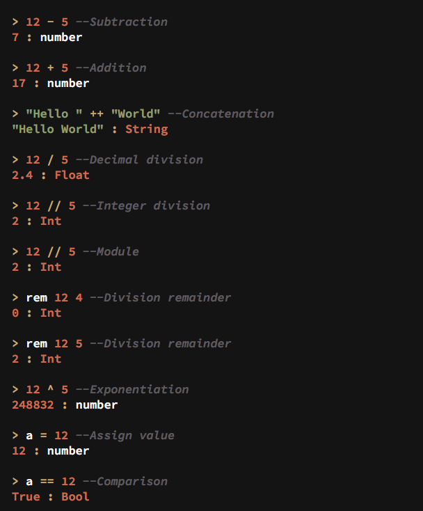
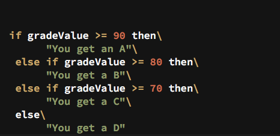
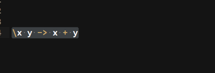
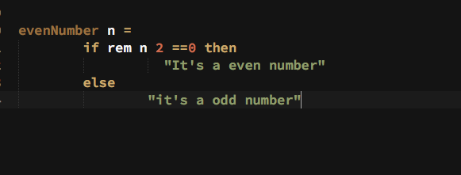
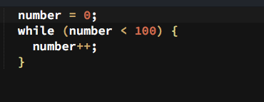
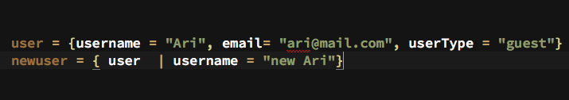
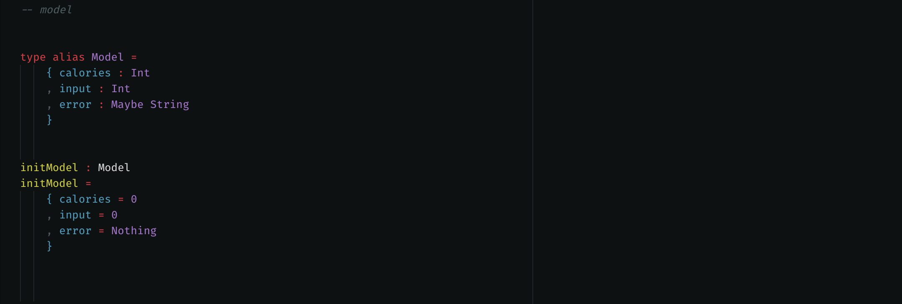
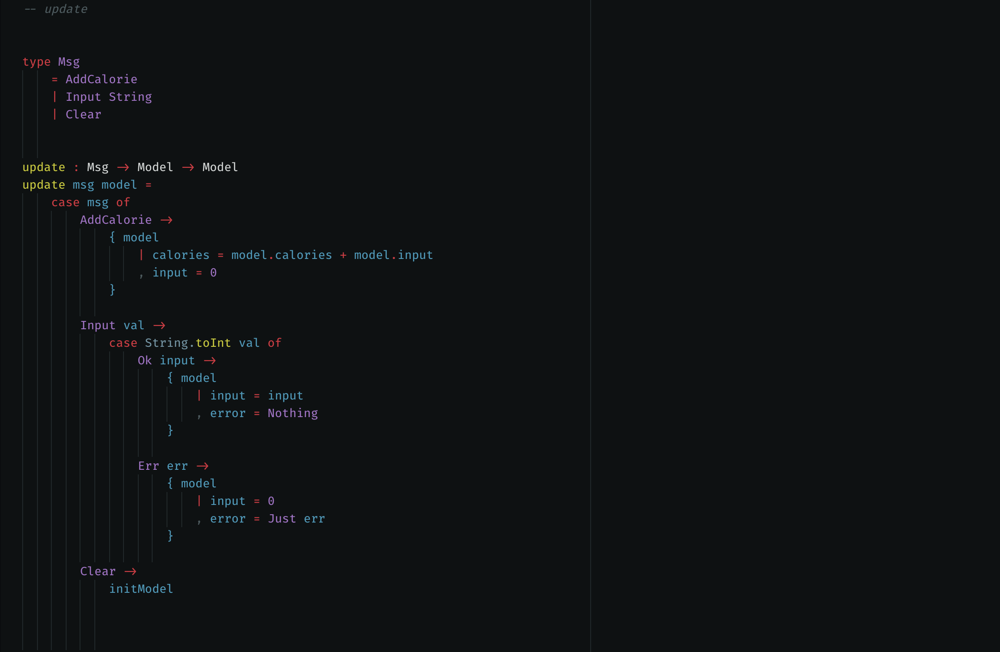
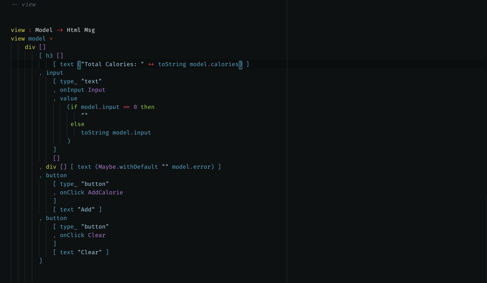
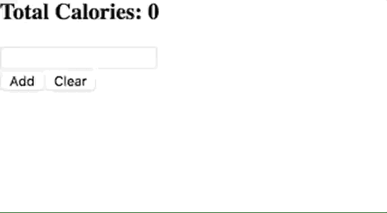

# Getting Started With Elm


## Introduction
Elm is an easy to use and robust functional language, created with the intentions to ease the web development process. It has a unique , but easy to interpret syntax. 

Install Elm-REPL to interact with Elm expressions and syntax.
* [For Mac ](http://install.elm-lang.org/Elm-Platform-0.18.pkg )
* [Windows ](http://install.elm-lang.org/Elm-Platform-0.18.exe)
* [Anywhere](https://www.npmjs.com/package/elm)

## Operators, Syntax and data types
### Basic operators
Elm uses almost the same syntax for all the standard symbols operators that Javascript and other languages use.


| Operator      | Used for            |
| ------------- |:-------------------:|
| -             | Subtraction         |
| --            | Comment             |
| +             | Addition            |
| ++            | Concatenation       |
| /             | Decimal division    |
| //            | Integer division    |
|               | (discard decimals)  |
| %             | Module              |
| rem           | Division remainder  |
| ^             | Exponentiation      |
| =             | Assign value        |
| ==            | Comparison          |
| --            | Comment             |



### Conditions(If, else if)

  Syntax 
  ```Elm
  if condition then
        statement1
  else if condition then
        statement2
  else if condition then
        statement3
  else
      statement4
  ```  



### Functions
Because Elm is a FP it relies mostly on functions, and that is why functions manipulation is flexible 
  * Functions can be named (regular functions)
  * Functions can be use without giving any name( anonymous functions )
  * They can be passed as arguments.
  * They can return another function as result.
  * They can be stored in list and variables
  * Can be easily assign 

#####  Syntax
  Anonymous functions(Used mostly as a callback function)
  \ parameter1 parameter2 parameter3 ... ->  
    statement

  

  funtionName parameter1 parameter2 parameter3 ... = 
    statement 

  

### Loops
 Loops don't exist in Elm, instead of "for" or "while" loops, the best practice is to use recursion. An alternative is to use some packages the expose those loop. e.g. Elm Loop, which use the same syntax as Js.

 

### List(Arrays)
##### Note: Elements should be the same type
##### There are tow different ways to define Lists 
The traditional way x = [ele1, ele2, ele3, ele4] 
Double colon x =  ele1 :: ele2 :: ele3 :: ele4 :: [] 

 
 

### Records
##### Records are similar to JS objects, but they work differently. Records in Elm are immutable, when you change a value in a record element, in reality you are creating a new copy of the record with with those changes.
  
  

## What makes Elm different ?

One thing that is worth to highlight about Elm is its amazing performance. Elm, as most front end frameworks, has its own virtual DOM implementation, but compare to others is one of the fastest, this is due to the fact that all values are immutable , which has been proved to make JavaScript code faster.


Another amazing feature about Elm is that it has no runtime exceptions, which means that the most commons errors don't make it to the user. That is because Elm checks all problems during compilation , and if its find any error, it would give you hints about the possible reason why your getting the error and the possible solutions for the same.
NO MORE "undefined is not a function"

## Architecture
Elm architecture is based on the Model, View and Controller(MVC) design pattern, the difference is that instead of a controller it uses Update, similar to React.
The Model is the data the application will operate on and its behavior, this is call "State" in other languages, Update defines what changes to make to the Model(state) given an action or an input, and in return it creates a new version of the state(remember that all values are immutable) with the resulting changes, the View defines what to render depending on the current state.

In the following calorie counter application, we have our code split into three sections.

First the `model`:


We are setting an [alias](https://guide.elm-lang.org/types/type_aliases.html) for our model and setting each part of our calorie app to its type. Next we set our initModel to the type alias we created and set out initModel to the beginning values of our calorie app.

Next is the `update`:


For the update it takes a Msg, sends it to the model, the updates the model (or changes the state) based on the msg sent. We initialize the Msg with three functions events:
`AddCalorie`, `Input` which is a String, and `Clear`.

To update the Msg we must update the `msg model` and similar to switch statements in other languages, we give different cases for the three msg types we declared above and what to do when they are called.

Lastly the `view`:


The view takes the `Html msg` in order to speak to the browser.
Importing the `Html.Events` and `Html.Attributes` allows you to use standard HTML tags, attributes and event listeners.

For example a HTML node in Elm take a HTML element with two [ ] [ ] brackets. The first bracket houses the attributes and events:
```elm
button [ type_ "button"
      , onClick Input]
```

While the second bracket holds the children nodes:
```elm
button [ type_ "button"
      , onClick Input]
       [ text "Add"]
```

And here is the result in the browser:



As you build more Elm apps, this will become the structure you will be accustom to seeing as you set up your `model`, `update`, and `view` architecture. Now let's move on to building our first, simpler Elm app.

## Building Our First Elm App: (Hello, Elm!)
### Creating an elm app locally

First we want to install elm on computer. In our terminal:

`npm install -g elm`

To test to see if elm is installed, we write:

`elm -v`

Make a new directory for elm project and create a Main.elm file

`mkdir elm-project`

`touch Main.elm`

Now let’s cd into the folder and run:

`elm package install elm-lang/html`

You should receive a prompt, saying:
```bash
Some new packages are needed. Here is the upgrade plan.

  Install:
    elm-lang/core 5.1.1
    elm-lang/html 2.0.0
    elm-lang/virtual-dom 2.0.4

Do you approve of this plan? [Y/n]
```
Hit `Y` to install the dependencies.
Now elm can compile to html and run in the browser

Writing our elm code from `Main.elm` looks like this:

```elm
module Main exposing (..)

import Html exposing (text)


main =
    text “Hello, Elm!”
```

As simple as that! Now let’s compile our code using this command:

`elm make Main.elm --output app.js`

`elm make` is compiling our code into a javascript file called `app.js` and now we can link to an HTML document.

At the root of our project directory we’ll create an `index.html` to store the script that the compiler generated for us from our Elm file.

```html
<!DOCTYPE html>
<html lang=“en”>
<head>
  <meta charset=“UTF-8”>
  <meta name=“viewport” content=“width=device-width, initial-scale=1.0”>
  <meta http-equiv=“X-UA-Compatible” content=“ie=edge”>
  <title>Hello Elm App</title>
</head>
<body>
  <div id=“app”></div>

  <script src=“app.js”></script>
  <script>
    var appContainer = document.querySelector(‘#app’)
    Elm.Main.embed(appContainer)
  </script>
</body>
</html>
```

We target our div that we created with an id of app in our script tags. We’re telling elm that we will embed our `Main.elm` file in that div that we assigned to a variable called `appContainer`.

That’s it. We created our first Elm app. Fire up your browser and open your html file and you should see “Hello, Elm!”.


## Module declaration
` module Main exposing (..) `
Every module in Elm starts with a module declaration and should be named the same as the file name.
e.g. `Main.elm` contains `module Main`
`exposing (..) ` exposes the functions and types to other modules importing. `(..)` means let’s expose everything

## Imports
`Import Html exposing (text)`
In the example above using `import Html `, we’re importing the Html module we want to use explicitly. We’re using the `text` type from the Html module so we import it to our application space using `exposing (text)`

## Main
```elm
main =
     text “Hello, Elm!”
```
Elm applications are rendered through the `main` function.  `main` returns an element to be placed on the page. 

Simple games built with Elm. I good idea for starters 
* [Chess](https://elm-chess.com/)
* [Concentration](https://robertbasden.github.io/elm-concentration/)
* [Tic Tac Toe](https://iamim.io/fcc-tictactoe-in-elm/)
